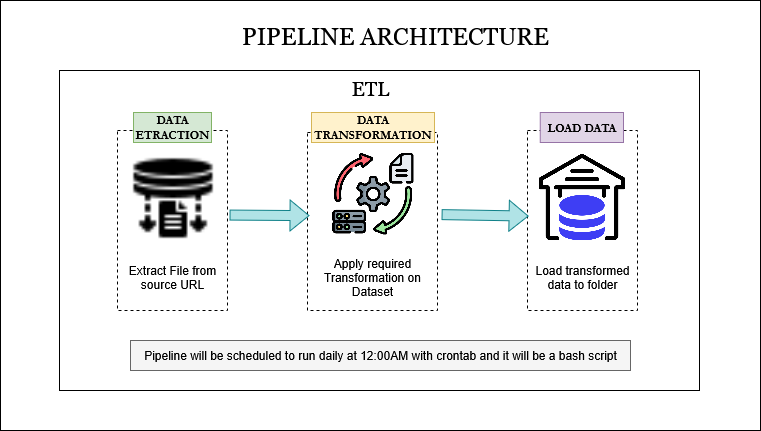

# Task 1: Bash ETL Pipeline Implementation

## Project Setup
- Created a working directory using `mkdir` to organize project files.
- Initialized a Git repository and linked it to the remote repository.
- Created a new branch `dev` to work on the task without affecting `main`.
- Added a `.gitignore` file to exclude all `.csv` files and `.env` to prevent sensitive data and large files from being pushed.

## Environment and Script Setup
- Created a `.env` file to store environment variables, including the dataset URL.
- Developed the main Bash script `etl.sh` which uses the `.env` file to perform ETL operations.

## Bash Script ETL Pipeline

### Extract
- Downloaded the dataset from the URL into a newly created folder `raw`.

### Transform
- Renamed the column `Variable_code` to `variable_code` using `sed`.
- Selected only the columns `year`, `Value`, `Units`, and `variable_code` using `awk`.
- Iterated over all column names in the header to identify correct column positions.
- Saved the transformed dataset in a new folder `Transformed` as `2023_year_finance.csv`.

### Load
- Created a new folder `Gold` and copied the transformed file to represent the final, production-ready dataset.

## Automation
- Scheduled the script to run daily at 12:00 AM using `crontab -e`.
- Preferred the `vim` editor to edit cron jobs.
- Set the cron expression as `0 0 * * *` and included the full script path.
- Configured logging so that script output is appended to a log file for monitoring.

## Git Workflow
- After successfully running the project on the `dev` branch, merged changes back into the `main` branch.
- Pushed changes to `origin dev` and created a pull request.
- Followed best practices for branching, development, and merging.

# Task 2: Bash Script to Move CSV and JSON Files

## Objective
Write a Bash script to move all CSV and JSON files from a source folder to a target folder named `json_and_CSV`. The script should work with one or more CSV and JSON files.

## Implementation

### Project Setup
- Identified the source folder named `Data`.
- Created a target folder `json_and_CSV` if it did not already exist.

### Script Logic
- Iterated through all files in the source folder.
- Checked the file extension to determine if it is `.csv` or `.json`.
- If the file matches the criteria, copied it to the target folder.
- Implemented logging to track all actions and confirm which files were moved successfully.

### Key Features
- Works with multiple files.
- Automatically creates the target folder if it does not exist.

## Task 3: Load CSV Files into PostgreSQL

### Project Setup
- Stored PostgreSQL credentials in a `.env` file.
- Loaded environment variables in the main Bash script `load_csv.sh`.

### Script Development
- Tested PostgreSQL connectivity using the provided credentials.
- Created the database `posey` if it did not exist.
- Created a schema named `dev` to organize tables.

### Data Loading Process
- Iterated over all CSV files in the source folder.
- Cleaned headers using `sed` for valid PostgreSQL column names.
- Converted all columns to `TEXT` datatype to avoid type mismatch issues.
- Converted file paths to Windows format using `cygpath` for compatibility with `\copy`.
- Dynamically loaded each CSV file into the `dev` schema in the `posey` database.
- Implemented logging to track all steps.

### Post-Load Data Handling
- Ran DDL commands to alter specific column data types as needed.
- Handled `NULL` values by updating columns to ensure data consistency.
- Queried the cleaned tables to extract business-required insights.

### Outcome
- Successfully loaded all CSV files into PostgreSQL.
- Cleaned, structured, and ready for analytics.
- The pipeline is reproducible, logged, and follows best practices for ETL into relational databases.

## Project Structure

- `Scripts/Bash Scripts/` – contains all Bash scripts for ETL and automation.
- `scripts/Sql Scripts/` – contains all SQL scripts used for database creation, table loading, and data manipulation.
- `Docs/` – folder containing images of project logs and design architecture.
